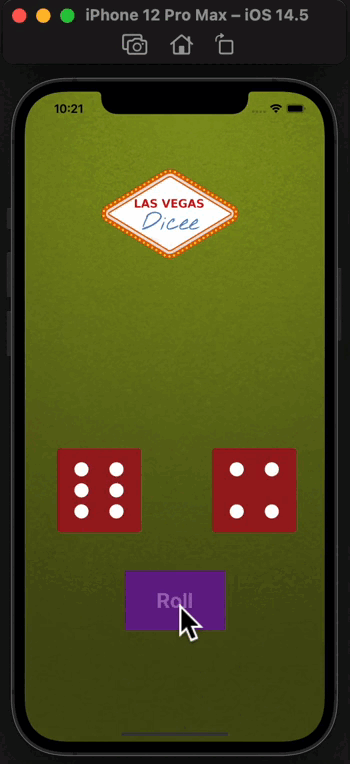

## DiceeGame

I built this a Las Vegas dice app. You can make the die roll at the press of a button or by shaking your phone. With this app in your pocket, you’ll be fully set up to settle any score on the go.

 </img> 

## What you will learn

* How to clone an existing Xcode project from GitHub.
* Create an app with behaviour and functionality.
* Create links between the Interface Builder files and code using IBActions and IBOutlets.
* Get familiar with the Xcode code editor.
* * Learn to use comments to annotate code.
* Understand and use Swift constants and variables.
* Understand and use collection types such as Swift arrays.
* Test and debug your app with the Xcode console.
* Learn about randomisation and how to generate random numbers in Swift.